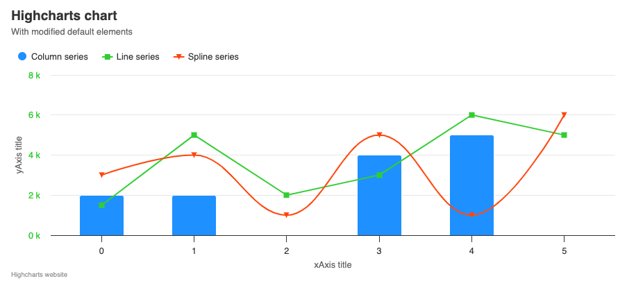

# Exercise 00 - Initial Chart

The first task is to show how to modify the basic chart elements and default settings. Your chart should look exactly like the one in the provided photo.

Pay attention to the position and content of the title, subtitle and credits. Move the legend, and modify the axis titles, formatting and styles. Change the default colors and symbols using the Highcharts built-in method to set options for all charts. Include 2 basic modules. The clues for them will be the menu in the upper right corner and a warning in the console.

Colors to use for the exercise:
- Blue: `#1E90FF`
- Green: `#32CD32`
- Red: `#FF4500`

