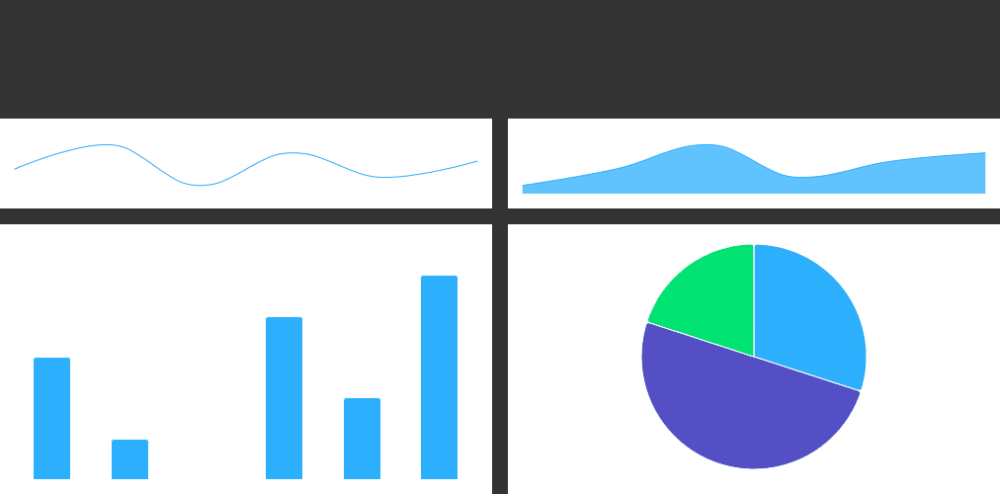

# Exercise 02 - Minimal Charts
Level: intermediate ⭐⭐

In this exercise, you will learn how to:
1. Set Global Defaults: Apply global settings to all charts using Highcharts.setOptions to standardize appearance, such as hiding titles, legends, credits, and disabling markers and data labels.
2. Create and Manage Series: Generate different chart types (spline, areaspline, column, and pie) and manage their data series to ensure accurate representation and display.
3. Customize Tooltips and Data Presentation:
Implement custom tooltips and data presentation logic, such as using HTML formatting and conditional display of tooltips.
4. Optimize Chart Layout: Learn to optimize the layout for charts with minimal elements, making them suitable for different screen sizes by disabling unnecessary components.
5. Understand the Impact of Global Settings: See how global configurations affect multiple chart types and how to adjust these settings to meet specific needs across different chart contexts.

In this task, you'll create multiple types of charts (spline, areaspline, column, and pie) using Highcharts and apply a set of global options to customize their appearance and behavior.

## Instructions:
1. **Set Global Options for All Charts**
* Objective
  * Use Highcharts.setOptions to apply global settings across all charts
* Details
  * Disable the title, legend, credits, and axis labels globally.
  * Remove grid lines and tick marks from axes.
  * Configure a global tooltip, and use HTML in it.
  * Hide markers and data labels for all series types.
* Documentation
  * Highcharts Global Options: https://api.highcharts.com/class-reference/Highcharts#.setOptions
  * Configure a global tooltip: https://api.highcharts.com/highcharts/tooltip
  * HTML in a tooltip: https://api.highcharts.com/highcharts/tooltip.formatter

2. **Render a Spline Chart**
* Objective
  * Create a spline chart with six data points.
* Details
  * Populate the chart with the specified data points and ensure it is rendered correctly (Spline chart should have 6 data points).
* Documentation
  * Spline Chart: https://api.highcharts.com/highcharts/series.spline

3. **Render an Areaspline Chart**
* Objective
  * Create an areaspline chart with six data points.
* Details
  * Populate the chart with the specified data points and ensure it is rendered correctly (Areaspline chart should have 6 data points).
* Documentation
  * Areaspline Chart: https://api.highcharts.com/highcharts/series.areaspline

4. **Render a Column Chart**
* Objective
  * Create a column chart with six data points, including one set to zero.
* Details
  * Populate the chart with the specified data points (Column chart should have 6 data points).
  * The third point of the column series should be equal to 0, undefined, or null.
* Documentation
  * Column Chart: https://api.highcharts.com/highcharts/series.column

5. **Render a Pie Chart with Custom Tooltip**
* Objective
  * Create a pie chart with three data points and a customized tooltip.
* Details
  * Populate the chart with the specified data points (Pie chart should have 3 data points).
* Documentation
  * Pie Chart: https://api.highcharts.com/highcharts/series.pie
