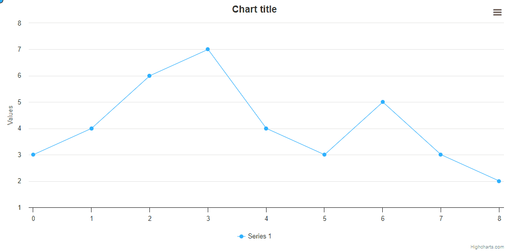

# Exercise 03 - Click Mousemove Cursor

Render a blue circle following the cursor, with a class name `'mouse-circle'`.
Save it on click like shown on the GIF below (saved circles should be the `'chart-circle'` CSS class name).
The saved points should have a label next to them with coordinates in axis units (`'chart-text'` CSS class) in
the format of `x: 0.00, y: 0.00`. The coordinates should be rounded to two decimal places.
Make sure the chart is responsive (e.g. when resizing the window), the points are in the right
position when changing the chart width.

