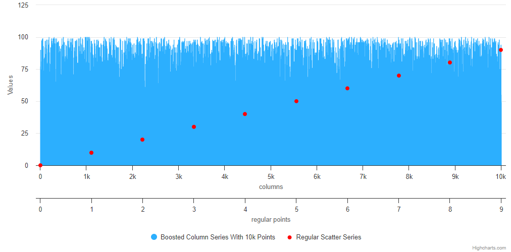

# Exercise 04 - Boosted Chart
Level: easy ⭐

In this exercise, you will learn how to:
1. Implement Boost Module for Large Data Sets:
Utilize the Boost module in Highcharts to handle large data sets efficiently, improving rendering performance.
2. Differentiate Between Boosted and Non-Boosted Series:
Understand how to set up series with and without boost mode based on data size and boost thresholds, learning to optimize performance selectively.
3. Configure Multiple Axes for Different Series Types:
Learn to configure multiple axes to handle different data types (columns and scatter) and align them appropriately within a single chart.

In this task, you'll create a Highcharts chart featuring a large boosted column series with 10,000 points and a smaller scatter series. You'll configure each series with separate x-axes and optimize performance using Highcharts' Boost module to handle large datasets efficiently

## Instructions
1. **Set Up a Column Series**
* Objective
  * Create a column series with 10,000 data points that is automatically boosted for improved performance.
* Details
  * Use Array.from() to generate 10,000 random integer data points for the column series.
  * Ensure to add the boost mode to enhance rendering efficiency.
* Documentation
  * Boost Module: https://www.highcharts.com/docs/advanced-chart-features/boost-module

2. **Create a Scatter Series**
* Objective
  * Add a scatter series with only 10 data points to be rendered without boost mode.
* Details
  * Generate 10 data points using Array.from() to simulate a smaller data set.
  * Set boostThreshold to 0 to explicitly prevent this series from being boosted, regardless of the data size.
* Documentation
  * Series Configuration: https://api.highcharts.com/highcharts/series.scatte
  * Boost Threshold: https://api.highcharts.com/highcharts/series.scatter.boostThreshold

3. **Configure Multiple x-Axes:**
* Objective
  * Set up two x-axes to support the column and scatter series, ensuring proper data representation and alignment.
* Details
  * Configure one x-axis for the column series and another for the scatter series to ensure clarity and correct scaling.
