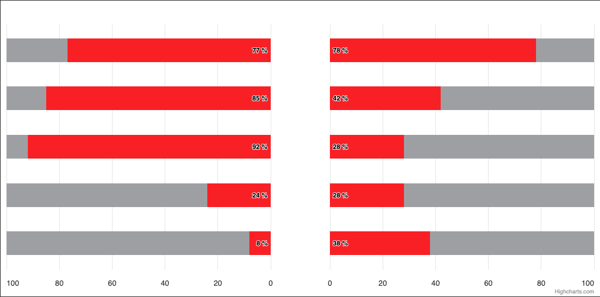

# Exercise 05 - Separate Axes

Create a bar chart with two separate red series on the separate axes. For reference, see the image below.

Requirements:
* Horizontal axes should have extremes exactly from 0 to 100. Axis values ​​on the left should decrease, on the right - increase.
* Series data labels should be inside the bars and aligned as on the image below.
* Vertical axis should be invisible.
* Don't forget about the gray background for bars. Avoid using renderer to draw it, there are much easier ways.
Remember they should not react to the mouse pointers.

If, after completing the task, some tests still fail, use their descriptions as a guide.

