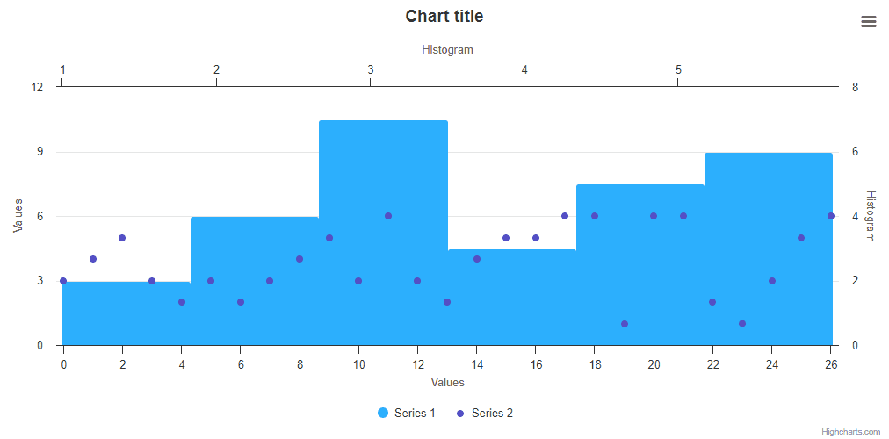

# Exercise 07 - Histogram Point Select

Create a chart with a following configuration:
* Series of type `scatter` which is plotting the following dataset:
```js
data: [3, 4, 5, 3, 2, 3, 2, 3, 4, 5, 3, 6, 3, 2, 4, 5, 5, 6, 6, 1, 6, 6, 2, 1, 3, 5, 6]
```
* Series of type `histogram`, which is based on the previous series. This series should be plotted on different `x` and `y` axes.
* The opposite axes should have the title `Histogram` and the normal axes should have the title `Values`.
* The histogram series should be selectable.
* The histogram series should be based on the scatter series.
* The inactive state should be turned off for all the series.
* Clicking on the histogram column should select the proper points.

see below GIF for a reference.

